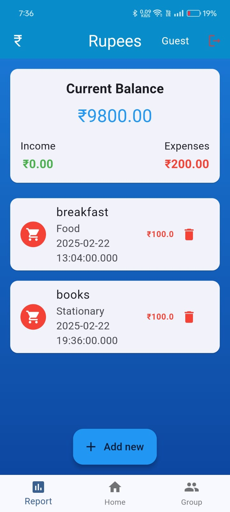
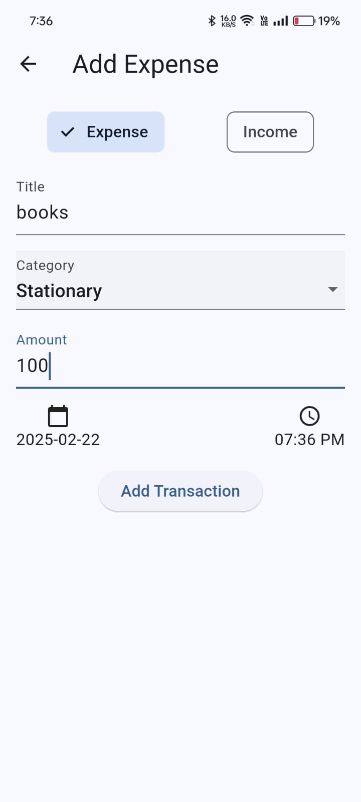
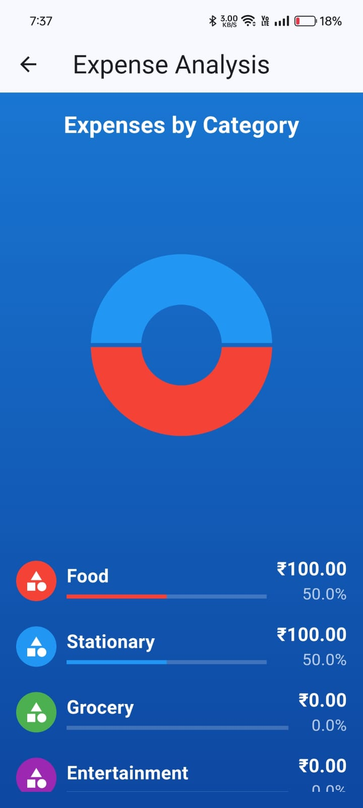
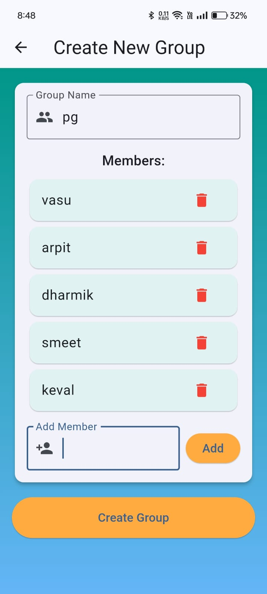
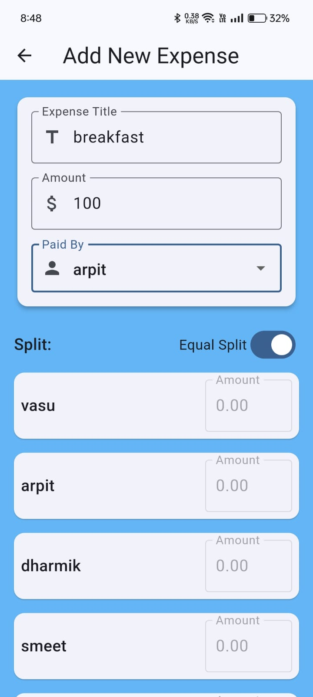
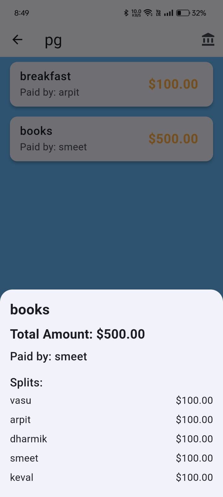
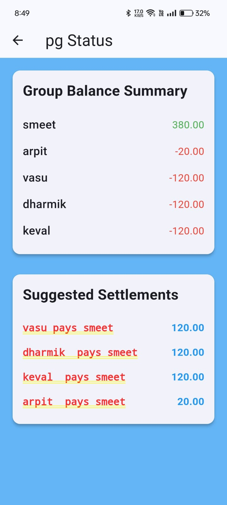

# **💰 Rupees - Budgeting for All**  

## **Overview**  
Rupees is designed for individuals who want to track their spending without manual entry. It automatically tracks UPI payments, categorizes expenses, and provides detailed analytics. For managing shared finances, such as in families or groups, Rupees simplifies tracking, splitting, and settling expenses. It also supports recurring payments and data export for further analysis. With a user-friendly interface, strong security, and reliable performance, Rupees makes financial management easy and accessible.

**📌 Price Prediction Model**  

]📥 **[Download Jupyter Notebook (.ipynb)](https://github.com/VASUVEKARIYA123/Rupees-budgeting-for-all/blob/main/Additional%20Files/Product_price_Model.ipynb)** (Product Price Prediction)  

## **📌 Screenshots**  

### **🏠 Home & Expense Tracking**  
<table>
  <tr>
    <td align="center"><b>Home Screen</b></td>
    <td align="center"><b>Add Expense</b></td>
    <td align="center"><b>Report</b></td>
  </tr>
  <tr>
    <td></td>
    <td></td>
    <td></td>
  </tr>
</table>

---

### **🔐 Authentication Screens**  
<table>
  <tr>
    <td align="center"><b>Login</b></td>
    <td align="center"><b>Reset Password</b></td>
    <td align="center"><b>Security Check</b></td>
  </tr>
  <tr>
    <td></td>
    <td></td>
    <td></td>
  </tr>
</table>

---

### **👥 Group Expense Management**  
<table>
  <tr>
    <td align="center"><b>Groups</b></td>
    <td align="center"><b>Create Group</b></td>
    <td align="center"><b>Group Expense</b></td>
  </tr>
  <tr>
    <td></td>
    <td></td>
    <td></td>
  </tr>
</table>

---

### **📝 Expense Details & Settlement**  
<table>
  <tr>
    <td align="center"><b>Add Expense</b></td>
    <td align="center"><b>Expense Description</b></td>
    <td align="center"><b>Expense Status</b></td>
  </tr>
  <tr>
    <td></td>
    <td></td>
    <td></td>
  </tr>
</table>

---

### **📢 Stay Updated!**  
🔹 More features coming soon!  
🔹 Your feedback helps us improve. 🚀  
