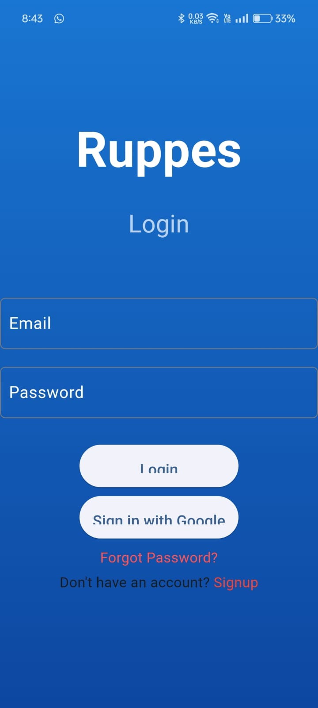
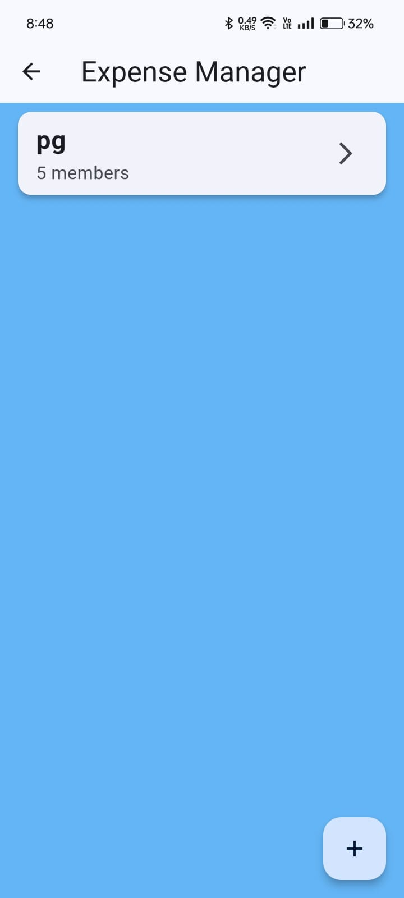

# Rupees - Budgeting for all

## Overview
Rupees is designed for individuals who want to track their spending without manual entry. It automatically tracks UPI payments, categorizes expenses, and provides detailed analytics. For managing shared finances, such as in families or groups, Rupees simplifies tracking, splitting, and settling expenses. It also supports recurring payments and data export for further analysis. With a user-friendly interface, strong security, and reliable performance, Rupees makes financial management easy and accessible.

## Home Screen

## Add Expense Screen

## Report Screen

## Report Screen

## Report Screen

## Report Screen

## Report Screen

## Report Screen

## Report Screen

## Report Screen

## Report Screen

## Report Screen

## Report Screen

## Report Screen

## Report Screen

